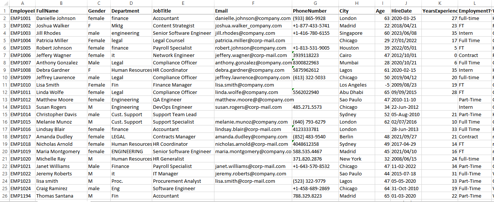
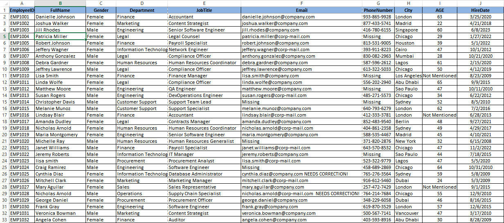

# Excel Employee Data Cleaning Project

This project demonstrates how to transform a raw, inconsistent employee dataset into a clean, standardized table ready for analysis. The raw dataset contains typos, inconsistent column labels, mixed date formats, irregular phone‐number formats, and missing or invalid fields. The cleaned dataset illustrates the result after correcting these issues, standardizing fields, and retaining only the most relevant columns.

## What was cleaned

- **Removed unused columns** such as `YearsExperience` and `EmploymentType` to focus on the core employee information.
- **Fixed inconsistent gender entries** (e.g. `M`, `f`, `Female` → `Male` and `Female`).
- **Corrected typos** in names and email addresses and ensured a consistent `FirstName LastName` format.
- **Standardized date formats** for the `HireDate` column.
- **Normalized phone numbers** to a consistent pattern and separated invalid numbers for manual review.
- **Preserved problematic records** by flagging them instead of deleting them, so that no potentially important data is lost.

## Project files

- [Download Raw Employee Dataset](Employee_Data_Raw.xlsx)
- [Download Cleaned Employee Dataset](Employee_Data_Cleaned.xlsx)

These Excel files allow you to compare the original data with the cleaned version side by side.

## Before and After

### Raw Dataset

The raw employee dataset includes extra columns, inconsistent labels, mixed date formats, variable phone‐number styles, missing fields, and invalid data entries.

### Cleaned Dataset

The cleaned dataset retains the most relevant columns—Employee ID, full name, gender, department, job title, email, phone number, city, age and hire date. Names are corrected, phone numbers are standardized, dates are normalized and records requiring manual review are flagged.

## How to reproduce

1. Inspect the raw data, identify inconsistent or invalid entries, and decide which columns are necessary.
2. Use Excel functions and filters to correct names, normalize formats (dates, phone numbers), and flag problematic records.
3. Remove extraneous columns and reorder the remaining columns for readability.
4. Save the cleaned version as a separate file while preserving the raw data for reference.

This project shows that thoughtful data cleaning and documentation make datasets easier to use and more trustworthy. Feel free to build upon this example or apply similar techniques to your own data.
